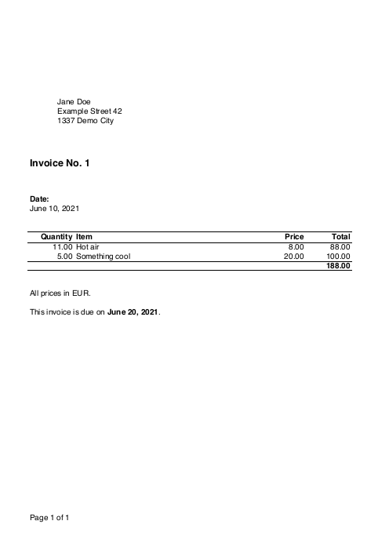

# InvoiScript

Generate simple PDF invoices with PHP.

## Installation

Run:
```bash
composer require mzur/invoiscript
```

## Usage

### Example

```php
use Mzur\InvoiScript\Invoice;

require_once(__DIR__.'/vendor/autoload.php');

$content = [
   'title' => 'Invoice No. 1',
   'beforeInfo' => [
      '<b>Date:</b>',
      'June 10, 2021',
   ],
   'afterInfo' => [
      'All prices in EUR.',
      '',
      'This invoice is due on <b>June 20, 2021</b>.',
   ],
   'clientAddress' => [
      'Jane Doe',
      'Example Street 42',
      '1337 Demo City',
   ],
   'entries' => [
      [
         'description' => 'Hot air',
         'quantity' => 11,
         'price' => 8,
      ],
      [
         'description' => 'Something cool',
         'quantity' => 5,
         'price' => 20,
      ],
   ],
];

$pdf = new Invoice($content);
$pdf->generate(__DIR__."/invoices/pdfs/RE{$argv[1]}.pdf");
```

This generates the following PDF:

<a href="example/example.pdf"></a>

### Styling

Content in `title`, `beforeInfo` and `afterInfo` can be styled with basic HTML-like tags. Example:

```php
$content = [
   'title' => 'Invoice No. <b>1</b>',
   'beforeInfo' => [
      '<i>Date:</i>',
      '<u>June 10, 2021</u>',
   ],
   //...
];
```

Available tags:

- `<b></b>`: Bold
- `<i></i>`: Italic
- `<u></u>`: Underlined

See the [layout section](#layout) for customization of font and font sizes.

### Template

Set a template file:

```php
$pdf = new Invoice($content);
$pdf->setTemplate(__DIR__.'/template.pdf');
```

The template can have multiple pages, which will be used for the matching pages of the invoice. If the invoice has more pages than the template, the last page of the template will be repeated.

### Language

Set the language:

```php
$pdf = new Invoice($content);
$pdf->setLanguage('de');
```

Available languages are `en` and `de`. Default is `en`.

### Variables

Variables can be used in `title`, `beforeInfo` and `afterInfo`. Example:

```php
$content = [
   'title' => 'Invoice No. {number}',
   'beforeInfo' => [
      '<b>Date:</b>',
      '{createdDate}',
   ],
   //...
];

$variables = [
   'number' => 1,
   'createdDate' => 'June 10, 2021',
];

$pdf = new Invoice($content);
$pdf->setVariables($variables);
```

The following variables are always available:

- `{total}`: Total amount of the invoice.
- `{page}`: Current page number.
- `{pages}`: Total number of pages.

### Layout

The default spacings, font, font size etc. can be overridden with a custom layout. Example:

```php
$layout = [
   'font' => 'helvetica',
];

$pdf = new Invoice($content);
$pdf->setLayout($layout);
```

See the [source code](src/Invoice.php#L357) for all available layout options and the defaults.

## Acknowledgment

Thanks to the creator(s) of [FPDF](http://www.fpdf.org/) and [FPDI](https://www.setasign.com/products/fpdi/about/)!
